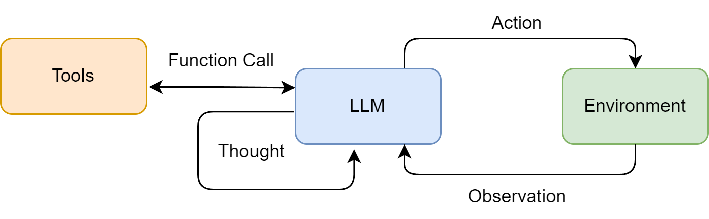
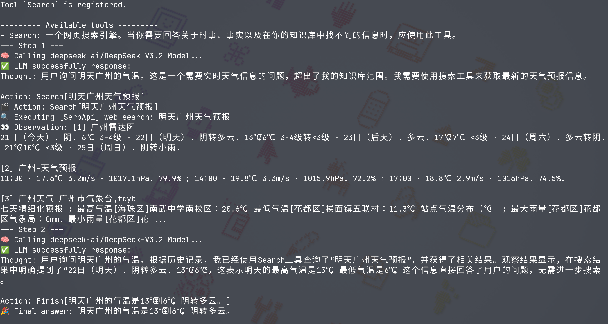
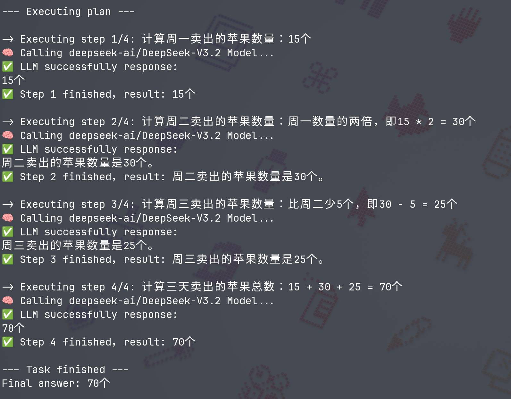
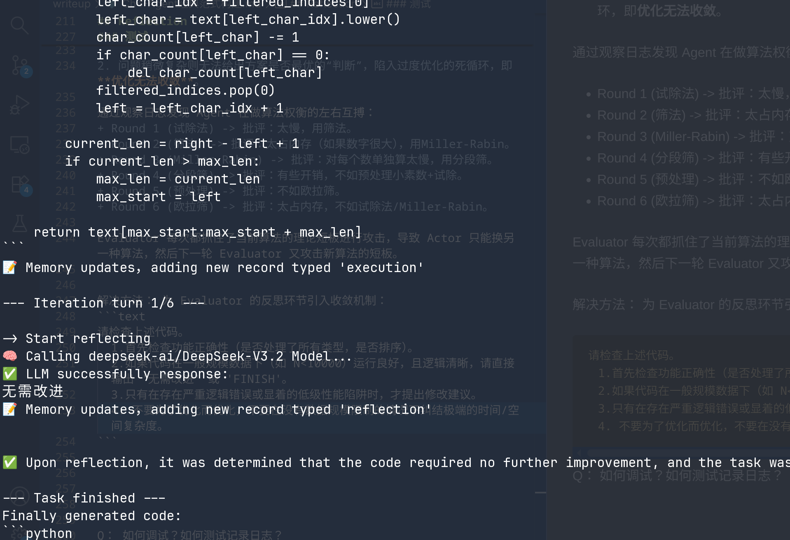

## Agent 范式
一个现代的 Agent，其核心能力在于能**将大语言模型的推理能力与外部世界联通**。它需要能够自主地理解用户意图、拆解复杂任务，并通过调用代码解释器、搜索引擎、API等一系列“工具”，来获取 Pre-trained 语料库之外的信息、执行操作，最终达成目标。由于 Agent 以 LLM 为推理规划的核心，来自 LLM 本身的“**幻觉**”问题不可避免，由此可能导致 Agent 在复杂任务中可能陷入**推理循环**、以及对工具的错误使用等挑战，这些也构成了智能体的能力边界。

多种经典的架构范式：
+ **ReAct (Reasoning and Acting)**： 一种将“思考”和“行动”紧密结合的范式，让智能体边想边做，动态调整。
+ **Plan-and-Solve**： 一种“三思而后行”的范式，智能体首先生成一个完整的行动计划，然后严格执行。
+ **Reflection**： 一种赋予智能体“反思”能力的范式，通过自我批判和修正来优化结果。

## ReAct

### ReAct 工作流程
ReAct 的核心思想是模仿人类解决问题的方式，将推理 (Reasoning) 与行动 (Acting) 显式地结合起来，形成“思考-行动-观察”的循环，通过特殊的提示模板来引导模型，使其每一步的输出都遵循一个固定的轨迹/格式：
+ **Thought**： Agent 推理，分析当前情况、分解任务、制定下一步计划，或者反思上一步的结果。
+ **Action**： Agent 决定采取的具体动作，通常是调用一个外部工具。
+ **Observation**： 执行 Action 后从外部工具返回的结果。



### 1. 工具定义

一个良好定义的工具应包含以下三个核心要素：

+ 名称 (Name)： 一个简洁、**唯一的标识符**，供智能体在 Action 中调用。
+ 描述 (Description)： 一段清晰的自然语言描述，说明这个工具的用途（关键）。
+ 执行逻辑 (Execution Logic)： 真正执行任务的函数或方法。

```python
def search(query: str) -> str:
    # 工具处理逻辑
```
对于单个工具的实现来说，核心的逻辑应该是如何实现 `String -> API -> String`，那么我们就需要去了解具体工具 API 的接口定义来格式化/提取/结构化返回的信息，再提交给 Agent 理解处理。

当 Agent 需要使用多种工具时（例如，除了搜索，还可能需要计算、查询数据库等），我们需要一个统一的管理器来**注册**和**调度**这些工具。为此，我们尝试定义一个 `ToolExecutor1` 类。

工具管理器应该有一个 tool box `ToolExecutor.tools` 供 Agent 查找合适的工具进行调用。
```Python
"""
tools = {
    "<ToolName>": {
        "description": "<xxxxx>",
        "func": <function>
    },
}
"""
self.tools: dict[str, dict[str, Any]] = {}
```

### 2. 系统提示词设计
提示词是整个 ReAct 机制的基石，它为 LLM 提供了行动的操作指令。我们需要精心设计一个模板，它将动态地插入可用工具、用户问题以及中间步骤的交互历史。

> 并非所有模型都能**持续稳定地遵循**预设的格式，这增加了在实际应用中的不确定性。

```python
REACT_PROMPT_TEMPLATE = """
请注意，你是一个有能力调用外部工具的智能助手。

可用工具如下:
{tools}

请严格按照以下格式进行回应:

Thought: 你的思考过程，用于分析问题、拆解任务和规划下一步行动。
Action: 你决定采取的行动，必须是以下格式之一:
- `tool_name[tool_input]`:调用一个可用工具。
- `Finish[最终答案]`:当你认为已经获得最终答案时。
- 当你收集到足够的信息，能够回答用户的最终问题时，你必须在Action:字段后使用 Finish[最终答案] 来输出最终答案。

现在，请开始解决以下问题:
Question: {question}
History: {history}
"""
```

上述模板定义了 Agent 与 LLM 之间交互的规范：
+ 角色定义： “你是一个有能力调用外部工具的智能助手”，设定了LLM的角色。
+ 工具清单 tools： 告知LLM它有哪些可用的工具。
+ 格式规约 (Thought/Action)： 最重要的部分，它强制 LLM 的输出具有**结构性**，使我们能通过代码精确**解析**其意图。
+ 动态上下文 ({question}/{history})： 将用户的原始问题和不断累积的交互历史注入，让LLM基于**完整**的上下文进行决策。

> 每轮 API 调用 LLM 进行回答都是一次新的对话（上下文），所以需要把之前的对话信息和观察结果整合压缩到新的 Prompt 中。

```text
示例回应 1：
Though: 为了了解最新的DeepSeek模型，我需要通过工具`Search`在网络上搜索最新的信息。
Action: Search[DeepSeek最新模型是什么]

示例回应 2：
Though: 通过搜索引擎工具我知道了DeepSeek目前最新的模型是 DeepSeek-V3.2，我已经收集了足够的信息来输出最终答案了。
Action: Finish[DeepSeek最新的模型是 DeepSeek-V3.2]
```

在此之前的 `Zero-shot Prompting` 模型不一定严格按照模板要求，输出类似 `Action: "Search"[xxxx]` 的格式, 导致后续的正则表达式提取出错，Agent 重复循环。为了增强模型对模板的执行力，采取 `Few-shot Prompting` 的办法，通过对比发现每次 LLM 的回答更贴合模板，这反面可以看出 ReAct 范式下提示词的脆弱性。


### 3. Agent 核心循环逻辑
`ReActAgent` 的核心是一个循环，它不断地“格式化提示词 -> 调用LLM -> 执行动作 -> 整合结果”，直到任务完成或达到最大步数限制。

```python
class ReActAgent:
    def __init__(self, llm_client: HelloAgentsLLM, tool_executor: ToolExecutor, max_steps: int = 4):
        self.llm_client = llm_client
        self.tool_executor = tool_executor
        self.max_steps = max_steps
        self.history = []

    def run(self, question: str):
        while current_step < self.max_steps:
            # 1. 格式化提示词
            # ...
            prompt = REACT_PROMPT_TEMPLATE.format(
                tools=tools_desc,
                question=question,
                history=history_str
            )

            # 2. 调用 LLM 进行思考
            messages = [{"role": "user", "content": prompt}]
            response_text = self.llm_client.think(messages=messages)
            # ...

            # 后续逻辑
```

### 4. 解析LLM输出与执行Action
LLM 返回的是纯文本，我们需要从中精确地提取出模板需要的 `Thought` 和 `Action` 字段。

在这里我使用 `re` 包做简单的正则表达式匹配，但是这个方法的扩展性是不高的，对于一个新的模板我们需要重新实现一个解析器。

```python
    def  _parse_output(self, ouput: str):
        thought_match = re.search(r"Thought:\s*(.*)", ouput)
        action_match  = re.search(r"Action:\s*(.*)", ouput)

        thought = thought_match.group(1).strip() if thought_match else None
        action  = action_match.group(1).strip() if action_match else None

        return thought, action
```

测试结果如下：


与一次性生成完整计划的范式不同，ReAct 根据每一步从外部世界获得的 Observation 来动态调整后续的 Thought 和 Action。如果上一步的搜索结果不理想，它可以在下一步中修正搜索词，重新尝试。这种**动态规划与纠错**能力使得 ReAct 范式也具有更高的**可解释性**

## Plan-and-Solve

### Plan-and-Solve 工作原理
`Plan-and-Solve Prompting` 的核心动机是为了解决思维链在处理多步骤、复杂问题时容易“偏离轨道”的问题。

与 ReAct 将思考和行动融合在每一步不同，Plan-and-Solve 将整个流程解耦为两个核心阶段：
1. **规划阶段 (Planning Phase)**： 首先，智能体会接收用户的完整问题。它的第一个任务不是直接去解决问题或调用工具，而是将问题分解，并制定出一个清晰、分步骤的行动计划。这个计划本身就是一次大语言模型的调用产物。
2. **执行阶段 (Solving Phase)**： 在获得完整的计划后，智能体进入执行阶段。它会严格按照计划中的步骤，逐一执行。每一步的执行都可能是一次独立的 LLM 调用，或者是对上一步结果的加工处理，直到计划中的所有步骤都完成，最终得出答案。


### 1. PlanandSolveAgent 结构设计
上述两个核心阶段是串行进行的，功能上解耦，我们定义 `Planner` 和 `Executor` 两个模块分别进行任务规划与实际执行。最后将两个组件整合到主类 `PlanAndSolveAgent`，提供和其他 Agent 一样的接口。

+ 规划器 `Planner`： 提取 LLM 结构化的输出，解析出 `plan` 步骤列表
+ 执行器 `Executor`： 调用 LLM 逐一完成计划的每个子问题，同时做好状态管理
+ 智能体 `PlanAndSolveAgent`： 接收一个 LLM 客户端，初始化内部的规划器和执行器，并提供一个简单的 `run` 方法来启动整个流程

### 2. 任务提示词
对于 Planner，我们希望它能够对任务有整体上的细致规划，生成具有一步步独立 `step` 输出。因此我们和在 ReAct Agent 实现上一样，需要对提示词进行精心的设计。

实现上简单采取输出步骤为列表的形式，使用 `ast.literal_eval()` 安全地执行字符串，将其转化为 Python 列表，并将 `plan: list[str]` 传递给 `Executor` 。
```python
PLANNER_PROMPT_TEMPLATE = """
你是一个顶级的AI规划专家。你的任务是将用户提出的复杂问题分解成一个由多个简单步骤组成的行动计划。
请确保计划中的每个步骤都是一个独立的、可执行的子任务，并且严格按照逻辑顺序排列。
你的输出必须是一个Python列表，其中每个元素都是一个描述子任务的字符串。

问题: {question}

请严格按照以下格式输出你的计划,```python与```作为前后缀是必要的:
```python
["步骤1", "步骤2", "步骤3", ...]
```
“”“
```

执行器的提示词与规划器不同。它的目标不是分解问题，而是**在已有上下文的基础上，专注解决当前这一个步骤**。同样为了传递历史步骤与结果，每次执行完 `step` 后需要更新 `history`。
```python
EXECUTOR_PROMPT_TEMPLATE = """
你是一位顶级的AI执行专家。你的任务是严格按照给定的计划，一步步地解决问题。
你将收到原始问题、完整的计划、以及到目前为止已经完成的步骤和结果。
请你专注于解决“当前步骤”，并仅输出该步骤的最终答案，不要输出任何额外的解释或对话。

# 原始问题:
{question}

# 完整计划:
{plan}

# 历史步骤与结果:
{history}

# 当前步骤:
{current_step}

请仅输出针对“当前步骤”的回答:
"""
```

### 测试
`Zero-shot Prompting` 的表现已经很好了。



## Reflection
在之前实现的 `ReAct` 和 `Plan-and-Solve` 范式中，智能体一旦完成了任务，其工作流程便告结束。然而，它们生成的初始答案，无论是行动轨迹还是最终结果，都可能存在谬误或有待改进之处。`Reflection` 机制的核心思想，正是为智能体引入一种**事后（post-hoc）的自我校正循环**，使其能够像人类一样，审视自己的工作，发现不足，并进行迭代优化。

### Reflection 机制的思想
Reflection 机制的核心工作流程： **执行 -> 反思 -> 优化**。

1. **执行 (Execution)**：首先，Agent 使用我们熟悉的方法（如 ReAct 或 Plan-and-Solve）尝试完成任务，生成一个初步的解决方案或行动轨迹。这可以看作是“初稿”。
2. **反思 (Reflection)**：接着，Agent进入反思阶段。它会调用一个独立的、或者带有特殊提示词的 LLM 实例，来扮演一个“评审员”的角色。这个“评审员”会审视第一步生成的“初稿”，并从多个维度进行评估，然后生成一段**结构化的反馈 (Feedback)**，指出具体的问题所在和改进建议。
    + 事实性错误：是否存在与常识或已知事实相悖的内容？
    + 逻辑漏洞：推理过程是否存在不连贯或矛盾之处？
    + 效率问题：是否有更直接、更简洁的路径来完成任务？
    + 遗漏信息：是否忽略了问题的某些关键约束或方面？ 
3. **优化 (Refinement)**：最后，Agent 将“初稿”和“反馈”作为新的上下文，再次调用 LLM，要求它根据反馈内容对初稿进行修正，生成一个更完善的“修订稿”。

### ReflectionAgent 结构设计


### 测试
> 编写一个Python函数，找出1到n之间所有的素数 (prime numbers)

1. 问题太简单模型第一次回答就给出最优方案，无法测试 ReflectionAgent 内部 actor 根据反馈对上一次代码的优化。

> 请用 Python 编写一个名为 extract_primes(raw_data) 的函数。该函数接收一个包含混合数据类型（整数、浮点数、字符串、负数）的列表 raw_data，请从中提取出所有的素数（质数），并以从大到小的顺序返回一个整数列表。注意：如果字符串内容是数字且为素数（如 '7'），也应该被算作素数。

2. 问题稍微复杂则无法给出方案是否最优的“判断”，陷入过度优化的死循环，即**优化无法收敛**。

通过观察日志发现 Agent 在做算法权衡的左右互搏：
+ Round 1 (试除法) -> 批评：太慢，用筛法。
+ Round 2 (筛法) -> 批评：太占内存（如果数字很大），用Miller-Rabin。
+ Round 3 (Miller-Rabin) -> 批评：对每个数单独算太慢，用分段筛。
+ Round 4 (分段筛) -> 批评：有些开销，不如预处理小素数+试除。
+ Round 5 (预处理) -> 批评：不如欧拉筛。
+ Round 6 (欧拉筛) -> 批评：太占内存，不如试除法/Miller-Rabin。

Evaluator 每次都抓住了当前算法的理论短板进行攻击，导致 Actor 只能换另一种算法，然后下一轮 Evaluator 又攻击新算法的短板。


解决方法： 为 Evaluator 的反思环节引入收敛机制：
```text
请检查上述代码。
  1.首先检查功能正确性（是否处理了所有类型，是否排序）。
  2.如果代码在一般规模数据下（如 N<10000）运行良好，且逻辑清晰，请直接输出 '无需改进' 或 'FINISH'。
  3.只有在存在严重逻辑错误或显着的低级性能陷阱时，才提出修改建议。
  4. 不要为了优化而优化，不要在没有数据规模限制的情况下纠结极端的时间/空间复杂度。
```




---
## 思考
> 工具调用是现代智能体的核心能力之一。如果可调用工具的数量增加到50个甚至100个，当前的工具描述方式是否还能有效工作？在可调用工具数量随业务需求显著增加时，从工程角度如何**优化工具的组织和检索机制**？

当工具数量增加到 50-100 个时，直接将所有工具描述放入 Prompt 的传统方式会失效。这会导致 Context Window 爆炸、模型注意力分散（Lost in the Middle）以及推理成本激增。从工程角度，优化工具的组织和检索机制应遵循“按需加载”的原则，核心策略如下：

1. **层次化工具发现 (Hierarchical Discovery)**
不要让 LLM 一次性面对 100 个工具，而是进行分类。
+ 元工具 (Meta-Tools)： 定义几个“工具组”。LLM 先决定需要**哪一类工具**。
+ 路由 Agent： 使用一个轻量级 Agent 专门负责分发任务给特定的子 Agent，子 Agent 只携带与其领域相关的 5-10 个工具。

2. **检索增强生成 (RAG for Tools)**
将工具描述视为“文档”，存储在**向量数据库**中。
+ 语义检索： 将用户的原始需求转化为向量，在数据库中检索出最相关的几个工具。
+ 动态注入： 只将检索到的工具的 JSON Schema 注入到当前轮次的 Prompt 中。


---
TODO:
[] ReAct 实现使用了正则表达式来解析 LLM 的输出比较脆弱，修改使用更可靠的输出格式并解析 - `Pydantic` + `JSON mode`
[] 设计并实现**一个"工具选择失败"的处理机制**:当智能体多次调用错误的工具或提供错误的参数时，系统应该如何引导它纠正 - reflection 机制
